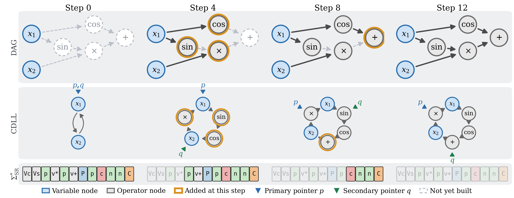
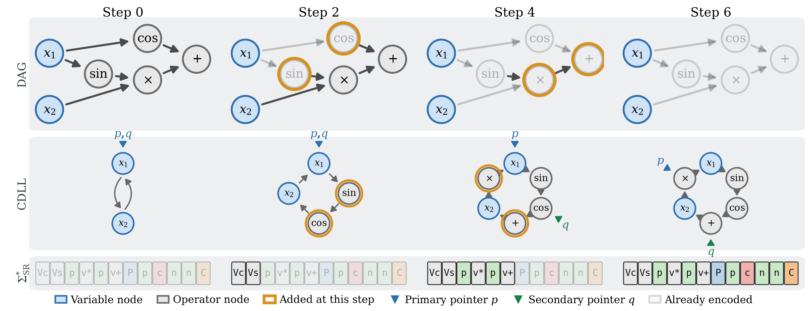

<div align="center">

# IsalSR

**Instruction Set and Language for Symbolic Regression**

*Every expression DAG has* Θ(k!) *node numberings. IsalSR gives it one string.*

[](https://mariopasc.github.io/IsalSR/)
[](https://www.python.org/)
[](docs/engineering/CPP_BUILD.md)
[](LICENSE)

</div>

---

## The problem

A symbolic regression solver searches over expressions, and an expression is a labeled
directed acyclic graph. A DAG with *k* internal nodes admits **Θ(k!) node numberings that
all encode the same expression**. Each occupies a separate point in the search space, and
each reaches the fitness evaluator as if it were new. At *k* = 8 that is over 40,000
redundant copies of every structurally distinct candidate.

Diversity preservation does not remove this: it acts on fitness and age, not on structure.
Equality saturation does not either: it asks whether two expressions denote the same
*function*, not whether two representations denote the same *graph*.

## The encoding

IsalSR writes a labeled DAG as a string of instructions driving a circular doubly linked
list with two mobile pointers. The alphabet Σ<sub>SR</sub> has **31 tokens**: 7 single
characters for pointer movement, edge creation and no-op, and 2 × 12 compound tokens
`V`ℓ / `v`ℓ that insert a node of label ℓ.

| | | |
|---|---|---|
| `N` `P` | move primary pointer | next / previous |
| `n` `p` | move secondary pointer | next / previous |
| `C` `c` | create edge | primary→secondary / secondary→primary, skipped if it closes a cycle |
| `W` | no-op | |
| `V`ℓ `v`ℓ | insert node of label ℓ | plus a creation edge from the acting pointer |

The twelve labels are `+ * g i s c e l r ^ a k` — Add, Mul, Neg, Inv, Sin, Cos, Exp, Log,
Sqrt, Pow, Abs, Const. There is deliberately no Sub and no Div: both are identities away
from commutative form, `x − y = Add(x, Neg(y))` and `x / y = Mul(x, Inv(y))`, which leaves
**Pow as the only operation whose operands must be ordered**.

### Decoding: string → DAG

<div align="center"></div>

S2D is a deterministic state machine. The DAG grows as each instruction inserts a labeled
node or a directed edge, with the two pointers navigating the list. Every string over
Σ<sub>SR</sub> decodes to a valid DAG: node insertions cannot close a cycle, and edge
instructions are skipped when they would.

### Encoding: DAG → string

<div align="center"></div>

D2S is greedy. At each step it walks the displacement set
𝒫<sub>n</sub> = {(a,b) : −n ≤ a,b ≤ n} ordered by cost |a| + |b|, and emits the first valid
operation, preferring node insertion over edge creation. But the greedy string **reads the
input DAG's node numbering**, so two numberings of one expression give two strings. That is
the dependency the canonical form removes.

### Canonicalization

The **fast canonical string** ŵ<sub>D</sub> replaces the greedy candidate choice with an
isomorphism-invariant one. Each candidate gets the key κ(c) = (label character, 1-WL subtree
hash); a unique minimum is taken greedily, and ties — which require both an equal label
*and* an equal subtree hash — are resolved by backtracking over the tied group alone. Under a
reachability condition, this is a **complete labeled-DAG invariant**:

> ŵ<sub>D₁</sub> = ŵ<sub>D₂</sub>  ⟺  D₁ ≅ D₂

in near-O(k²) time, against O(k!) for exhaustive minimization. Fewer than 4% of random
expression DAGs tie at all.

## Install

Core has **zero runtime dependencies** — Python standard library only. Two interchangeable
engines compute the same canonical strings; **use the C++ one**.

### C++ engine (recommended)

```bash
conda create -n isalsr python=3.11 -y
conda activate isalsr

pip install nanobind ninja                # build-time only
pip install -e ".[dev,native]" -v         # builds isalsr.core._native via CMake

python -c "from isalsr.core import backends; print(backends.engine())"   # -> cpp
```

Requires gcc ≥ 10, cmake ≥ 3.18 and ninja. Full build guide, ISA-level rationale and the
Picasso/SLURM recipe: [`docs/engineering/CPP_BUILD.md`](docs/engineering/CPP_BUILD.md).

### Pure Python engine

```bash
conda create -n isalsr python=3.11 -y
conda activate isalsr
pip install -e ".[dev]"

python -c "from isalsr.core import backends; print(backends.engine())"   # -> python
```

If the compiled extension is absent, every call falls back to Python transparently. Set
`ISALSR_ENGINE=python` to force the fallback in a session with the extension installed;
`ISALSR_ENGINE=cpp` raises immediately if it is missing, rather than failing silently later.

### Why C++

The two engines are behaviourally identical and one is far cheaper. On 300 random expression
DAGs (*k* ≥ 4, *m* = 2, 1,500 canonicalizations, i7-13700KF, gcc 12.2.0):

| Engine | Cost per DAG | Canonical strings |
|---|---|---|
| `cpp` | **0.19 ms** | identical on all 300 |
| `python` | 3.71 ms | identical on all 300 |

Canonicalization sits on the evaluation hot path of the host solver, so a 19× difference
there is the difference between a negligible overhead and a visible one. **Never trust a
`backend="cpp"` timing without checking the extension actually rebuilt** — see the
verification commands in the build guide.

> ⚠️ `pip install -e . --no-build-isolation` fails silently unless `scikit_build_core` is
> already in the environment, leaving a stale `.so` loaded. Use
> `pip install -e . --force-reinstall --no-deps` to rebuild.

## Quick start

```python
from isalsr.core import backends
from isalsr.core.string_to_dag import StringToDAG
from isalsr.core.canonical import fast_canonical_string

print(backends.engine())                                    # 'cpp'

# Two numberings of sin(x1) + cos(x1) give two greedy encodings...
a = StringToDAG("VsVcpv+Ppc", num_variables=1).run()
b = StringToDAG("VcVspv+Ppc", num_variables=1).run()

# ...and one canonical string.
print(fast_canonical_string(a))                             # 'VcVspv+Ppc'
print(fast_canonical_string(b))                             # 'VcVspv+Ppc'
```

Integrating with a solver is one step at the evaluation boundary: convert the candidate to a
labeled DAG, compute its canonical string, and skip evaluation if the string has been seen.
No hyperparameter, search operator or termination criterion changes.

An [interactive playground](https://mariopasc.github.io/IsalSR/playground.html) runs S2D,
D2S and the canonical string in the browser, and enumerates all *k*! numberings of an
expression to show them collapse onto one string.

## Results

Validated on two solvers with contrasting search strategies — UDFS (systematic enumerator)
and Bingo (evolutionary) — over a 70-problem suite drawn from nine published benchmarks,
30 seeds and a 12-hour budget per run: **12,600 runs**. Each host runs three arms differing
only in the equivalence relation applied to the candidate stream: its native representation,
a naive hash of a fixed-order serialization, and IsalSR.

| | UDFS | Bingo |
|---|---|---|
| Reduction factor ρ | 1.66 ± 0.26 | 1.79 ± 0.09 |
| Evaluations removed | **38.1%** | **43.7%** |
| Problems with ρ > 1 | 70 / 70 | 70 / 70 |
| *R*²<sub>test</sub> paired test vs. native | *d* = +0.41, *p* = 2.0×10⁻⁹ | *d* = +0.08, *p* = 7.5×10⁻⁴ |
| ρ vs. naive hash (Cohen's *d*) | 2.54 | 7.05 |
| Canonicalization overhead | 0.04% | 16.1% |
| Share φ needing an isomorphism test | 1.00 | 0.047 |

Read the last two rows together, because they are the honest trade. On UDFS, evaluation
costs 727 ms against 0.126 ms for canonicalization, and the naive hash merges *nothing*:
every duplicate there is a node renumbering. On Bingo both costs are sub-millisecond, the
deduplicated search is 1.45× slower end to end, and a plain equality check already recovers
95.3% of what canonicalization removes. **IsalSR pays off when fitness evaluation dominates
canonicalization** — large training sets, complex expressions, simulation-based evaluation.

Full tables, critical-difference diagrams and limitations:
[mariopasc.github.io/IsalSR/results](https://mariopasc.github.io/IsalSR/results.html).

## Repository

```
src/isalsr/core/        S2D, D2S, canonical string, labeled DAG, CDLL — zero dependencies
src/isalsr/core/native/ the C++17 engine (nanobind), same semantics, ~19x faster
src/isalsr/adapters/    SymPy and NetworkX bridges
src/isalsr/evaluation/  fitness metrics, protected operators, constant optimization
experiments/models/     host-solver integration (Bingo, UDFS) and the analysis pipeline
benchmarks/datasets/    the 70-problem suite
docs/                   the companion website
tests/                  unit, property and integration suites
```

```bash
python -m pytest tests/unit -q       # fast, no external dependencies
python -m ruff check src/ tests/
python -m mypy src/isalsr/
```

## Citation

```bibtex
@article{lopezrubio2026isalsr,
  title   = {Representation of Directed Acyclic Graphs by Sequences of Instructions
             for Symbolic Regression},
  author  = {L{\'o}pez-Rubio, Ezequiel and Pascual-Gonz{\'a}lez, Mario and
             Thurnhofer-Hemsi, Karl},
  journal = {IEEE Transactions on Pattern Analysis and Machine Intelligence},
  note    = {Under review},
  year    = {2026}
}
```

IsalSR belongs to a family of instruction-based graph encodings opened by
[IsalGraph](https://arxiv.org/abs/2603.11039) (unlabeled undirected graphs) and continued by
IsalChem ([doi:10.1021/acs.jcim.5c00572](https://doi.org/10.1021/acs.jcim.5c00572), molecular
graphs). Labels on internal nodes, directed edges and a non-commutative operator make this
setting harder rather than merely larger.

## License

MIT — see [LICENSE](LICENSE).

<div align="center">
<sub>
Computational Intelligence and Image Analysis group · Universidad de Málaga<br>
Ezequiel López-Rubio · Mario Pascual-González · Karl Thurnhofer-Hemsi
</sub>
</div>
