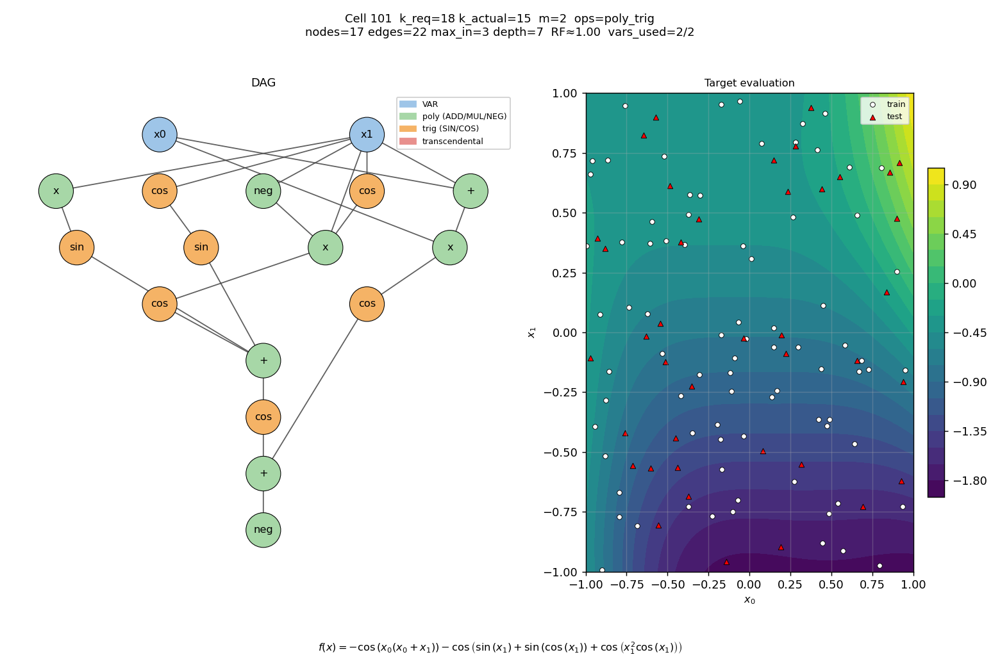
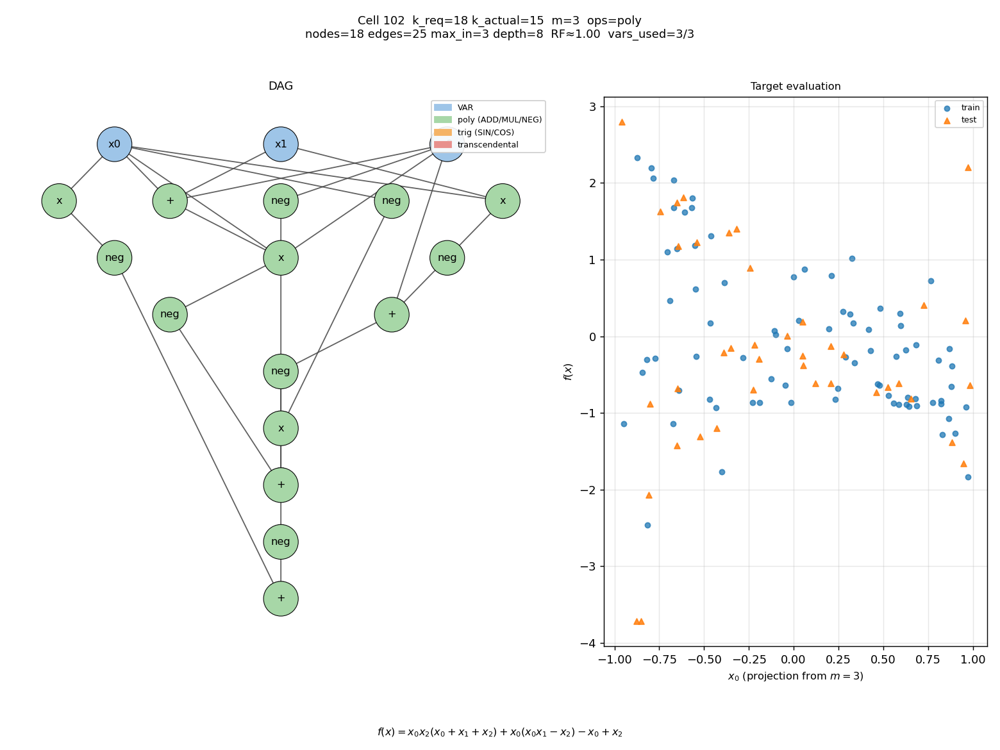
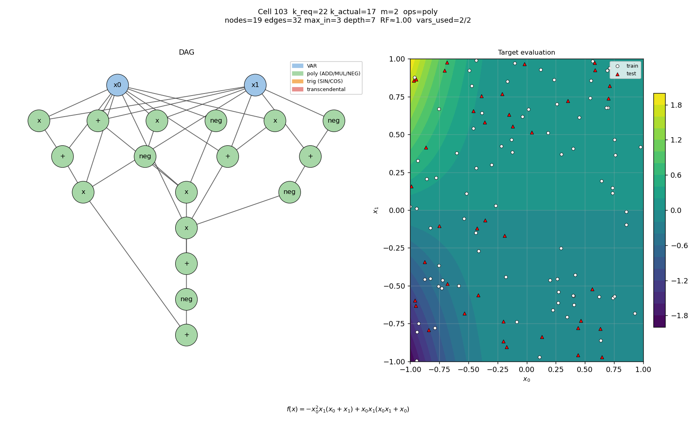
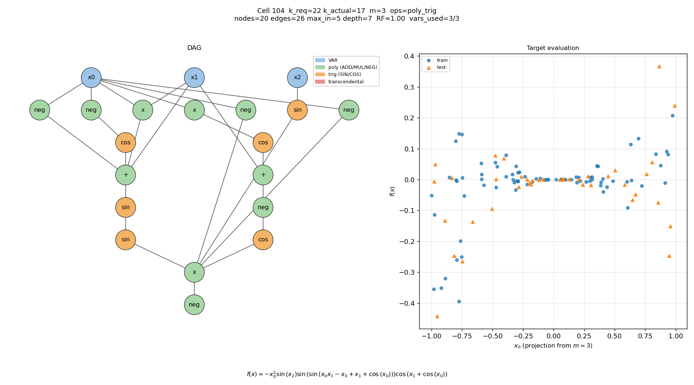
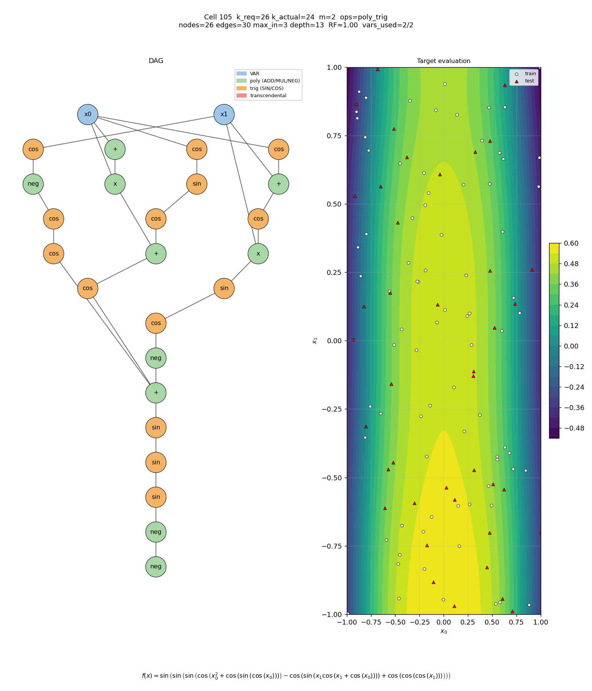
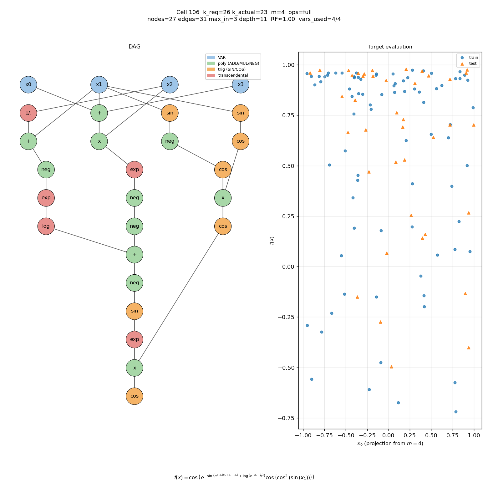
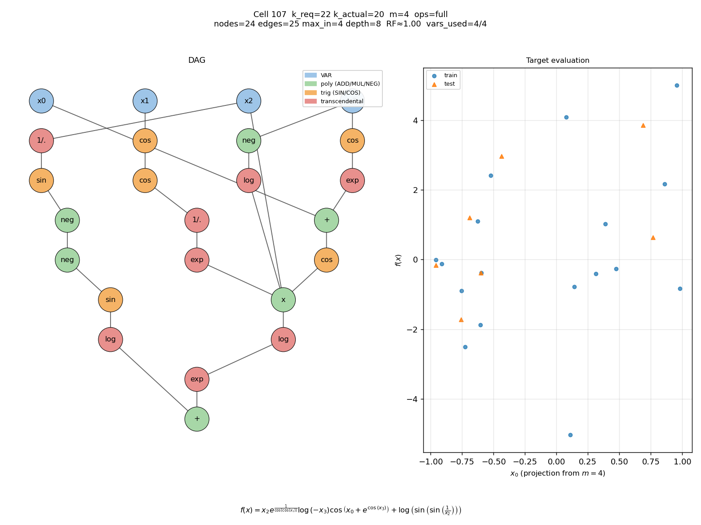
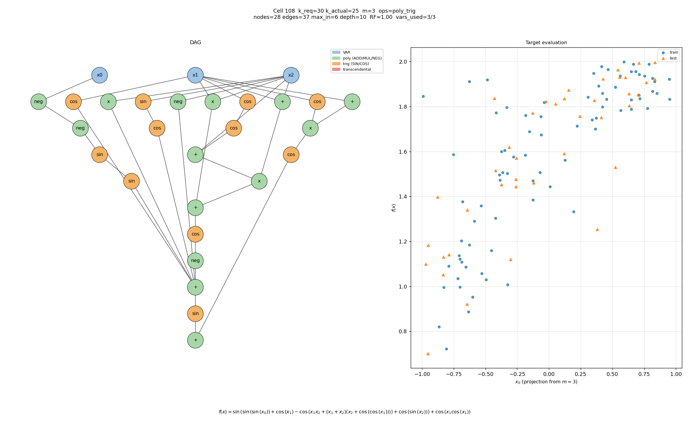

# Random DAG screening — preview gallery

_Generated with seed=42, perm_samples=200._

Each row below is one design cell. RF estimate = (# permutations sampled)
/ (# unique canonical strings); RF ≈ k! / |Aut(D)|.

## Cell 101 — k=18, m=2, ops=`poly_trig`

_k=18, m=2, poly+trig_

- nodes=17, edges=22, vars_used=2/2
- max_in_degree=3, max_out_degree=6, depth=7
- estimated RF ≈ **1.00** (200 distinct fingerprints / 200 perms; k_actual=15, k! = 1307674368000)
- canonical invariance: OK (1 unique canonical)
- canonical len = 78
- target: $f(x) = - \cos{\left(x_{0} \left(x_{0} + x_{1}\right) \right)} - \cos{\left(\sin{\left(x_{1} \right)} + \sin{\left(\cos{\left(x_{1} \right)} \right)} + \cos{\left(x_{1}^{2} \cos{\left(x_{1} \right)} \right)} \right)}$

## Cell 102 — k=18, m=3, ops=`poly`

_k=18, m=3, pure poly_

- nodes=18, edges=25, vars_used=3/3
- max_in_degree=3, max_out_degree=5, depth=8
- estimated RF ≈ **1.00** (200 distinct fingerprints / 200 perms; k_actual=15, k! = 1307674368000)
- canonical invariance: OK (1 unique canonical)
- canonical len = 86
- target: $f(x) = x_{0} x_{2} \left(x_{0} + x_{1} + x_{2}\right) + x_{0} \left(x_{0} x_{1} - x_{2}\right) - x_{0} + x_{2}$

## Cell 103 — k=22, m=2, ops=`poly`

_k=22, m=2, pure poly_

- nodes=19, edges=32, vars_used=2/2
- max_in_degree=3, max_out_degree=9, depth=7
- estimated RF ≈ **1.00** (200 distinct fingerprints / 200 perms; k_actual=17, k! = 355687428096000)
- canonical invariance: OK (1 unique canonical)
- canonical len = 103
- target: $f(x) = - x_{0}^{2} x_{1} \left(x_{0} + x_{1}\right) + x_{0} x_{1} \left(x_{0} x_{1} + x_{0}\right)$

## Cell 104 — k=22, m=3, ops=`poly_trig`

_k=22, m=3, poly+trig_

- nodes=20, edges=26, vars_used=3/3
- max_in_degree=5, max_out_degree=6, depth=7
- estimated RF ≈ **1.00** (200 distinct fingerprints / 200 perms; k_actual=17, k! = 355687428096000)
- canonical invariance: OK (1 unique canonical)
- canonical len = 83
- target: $f(x) = - x_{0}^{2} \sin{\left(x_{2} \right)} \sin{\left(\sin{\left(x_{0} x_{1} - x_{0} + x_{1} + \cos{\left(x_{0} \right)} \right)} \right)} \cos{\left(x_{1} + \cos{\left(x_{0} \right)} \right)}$

## Cell 105 — k=26, m=2, ops=`poly_trig`

_k=26, m=2, poly+trig_

- nodes=26, edges=30, vars_used=2/2
- max_in_degree=3, max_out_degree=4, depth=13
- estimated RF ≈ **1.00** (200 distinct fingerprints / 200 perms; k_actual=24, k! = 620448401733239439360000)
- canonical invariance: OK (1 unique canonical)
- canonical len = 110
- target: $f(x) = \sin{\left(\sin{\left(\sin{\left(\cos{\left(x_{0}^{2} + \cos{\left(\sin{\left(\cos{\left(x_{0} \right)} \right)} \right)} \right)} - \cos{\left(\sin{\left(x_{1} \cos{\left(x_{1} + \cos{\left(x_{0} \right)} \right)} \right)} \right)} + \cos{\left(\cos{\left(\cos{\left(x_{1} \right)} \right)} \right)} \right)} \right)} \right)}$

## Cell 106 — k=26, m=4, ops=`full`

_k=26, m=4, full alphabet_

- nodes=27, edges=31, vars_used=4/4
- max_in_degree=3, max_out_degree=5, depth=11
- estimated RF ≈ **1.00** (200 distinct fingerprints / 200 perms; k_actual=23, k! = 25852016738884976640000)
- canonical invariance: OK (1 unique canonical)
- canonical len = 131
- target: $f(x) = \cos{\left(e^{- \sin{\left(e^{x_{1} x_{2} \left(x_{0} + x_{1} + x_{3}\right)} + \log{\left(e^{- x_{1} - \frac{1}{x_{2}}} \right)} \right)}} \cos{\left(\cos^{2}{\left(\sin{\left(x_{1} \right)} \right)} \right)} \right)}$

## Cell 107 — k=22, m=4, ops=`full`

_k=22, m=4, full alphabet_

- nodes=24, edges=25, vars_used=4/4
- max_in_degree=4, max_out_degree=2, depth=8
- estimated RF ≈ **1.00** (200 distinct fingerprints / 200 perms; k_actual=20, k! = 2432902008176640000)
- canonical invariance: OK (1 unique canonical)
- canonical len = 92
- target: $f(x) = x_{2} e^{\frac{1}{\cos{\left(\cos{\left(x_{1} \right)} \right)}}} \log{\left(- x_{3} \right)} \cos{\left(x_{0} + e^{\cos{\left(x_{3} \right)}} \right)} + \log{\left(\sin{\left(\sin{\left(\frac{1}{x_{2}} \right)} \right)} \right)}$

## Cell 108 — k=30, m=3, ops=`poly_trig`

_k=30, m=3, poly+trig (XL)_

- nodes=28, edges=37, vars_used=3/3
- max_in_degree=6, max_out_degree=6, depth=10
- estimated RF ≈ **1.00** (200 distinct fingerprints / 200 perms; k_actual=25, k! = 15511210043330985984000000)
- canonical invariance: OK (1 unique canonical)
- canonical len = 140
- target: $f(x) = \sin{\left(\sin{\left(\sin{\left(x_{0} \right)} \right)} + \cos{\left(x_{1} \right)} - \cos{\left(x_{1} x_{2} + \left(x_{1} + x_{2}\right) \left(x_{2} + \cos{\left(\cos{\left(x_{1} \right)} \right)}\right) \right)} + \cos{\left(\sin{\left(x_{2} \right)} \right)} \right)} + \cos{\left(x_{1} \cos{\left(x_{1} \right)} \right)}$
