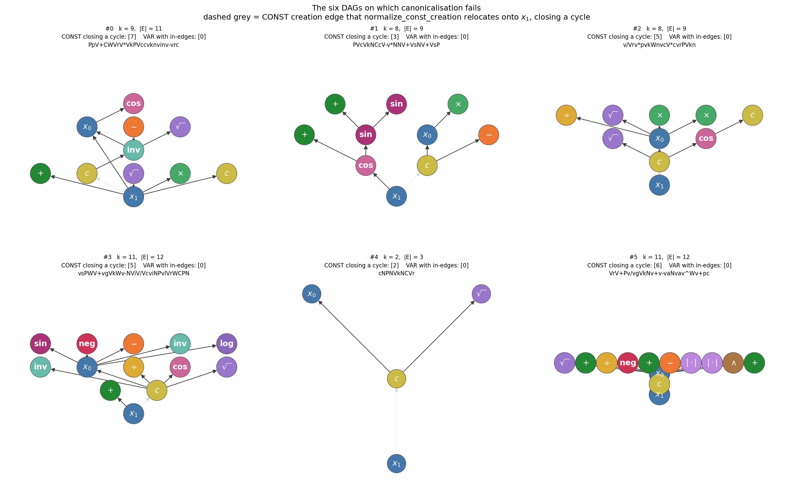

# Canonicalisation failures in D2S: six counterexamples and their cause

**Date**: 2026-07-27
**Ticket**: [`T15-d2s-failure-modes.md`](../../../.claude/notes/review/tasks/T15-d2s-failure-modes.md)
**Origin**: found during T01 (C++ core port) equivalence testing
**Reproduce**: `python -m experiments.scripts.generate_fig_d2s_failures --out docs/md_files/changes`

---

## 1. Summary

Over a deterministic corpus of 4,000 randomly generated DAGs
(`random.Random(31)`, 2 variables), `fast_canonical_string` raises
`RuntimeError: Fast canonical D2S: no valid operation found` on **6 DAGs
(0.15 %)**.

Three findings, all measured rather than argued:

1. **It is not the pruning.** Every canonicalisation variant fails on the same 6,
   including the exhaustive reference that performs no pruning at all.
2. **It is `normalize_const_creation`.** All 6 canonicalise successfully when that
   normalisation step is bypassed.
3. **The failing DAGs satisfy the reachability condition** stated in the
   manuscript, so that hypothesis is not sufficient to guarantee round-trip
   fidelity.

The rate on *real* Bingo/UDFS search output is not yet measured — that is T15
§5.3, and it is the number that decides whether any published result is affected.

---

## 2. The six DAGs



Dashed grey edges are CONST creation edges that `normalize_const_creation`
relocates onto `x_1`. Raw data: [`fig_d2s_failures_data.json`](fig_d2s_failures_data.json).

| # | k | \|E\| | CONST closing a cycle | VAR with in-edges | S2D source |
|---|---|---|---|---|---|
| 0 | 9 | 11 | node 7 | node 0 | `PpV+CWVrV*VkPVccvknvinv-vrc` |
| 1 | 8 | 9 | node 3 | node 0 | `PVcVkNCcV-v*NNV+VsNV+VsP` |
| 2 | 8 | 9 | node 5 | node 0 | `v/Vrv*pvkWnvcV*cvrPVkn` |
| 3 | 11 | 12 | node 5 | node 0 | `vsPWV+vgVkWv-NViV/VcviNPvlVrWCPN` |
| 4 | 2 | 3 | node 2 | node 0 | `cNPNVkNCVr` |
| 5 | 11 | 12 | node 6 | node 0 | `VrV+Pv/vgVkNv+v-vaNvav^Wv+pc` |

Case #4 is the minimal one: 2 internal nodes, 3 edges. It is the right example to
reason about, and the right one to put in a proof.

---

## 3. Which canonicalisation algorithm does production use?

**`fast_canonical_string(dag, mode="wl_only")`** — greedy, guided by the 1-WL
subtree hash, with backtracking over tied candidates.

The chain, verified in code:

| Step | Evidence |
|---|---|
| Config default | `use_fast_canonical: bool = True` — `experiments/models/bingo/config.py:33`, `experiments/models/udfs/config.py:30` |
| Every production YAML sets it | `use_fast_canonical: true` in all `experiments/configs/*.yaml` |
| Runner branch | `if self.dedup.use_fast_canonical: … fast_canonical_string(dag, timeout=…)` — `bingo/isalsr_runner.py:321–326`, `udfs/isalsr_runner.py:113–115` |
| `mode` argument | **not passed**, so the default applies |
| Default | `mode: CanonicalMode = "wl_only"` in `fast_canonical_string` |

So `wl_only` is what generated every reported number. This matches the
manuscript's abstract — *"computed by a greedy algorithm guided by
1-Weisfeiler--Leman (1-WL) subtree hashing"*.

**One terminology point worth keeping straight.** "1-WL pruning" conflates two
distinct mechanisms:

- the **1-WL subtree hash** is a *sort key*. Candidates are ordered by
  `(label_char, WL_hash)`; if the best is unique it is taken greedily, and ties
  are resolved by backtracking to lexmin.
- the **6-tuple** is a separate *pruning* rule (Critical Invariant 10), used by
  `pruned_canonical_string` and by modes `wl_tiebreak` and `tuple_only`.

Production `wl_only` **does not use the 6-tuple at all**. So the algorithm in the
paper is greedy + 1-WL, and the 6-tuple machinery is legacy.

---

## 4. Failure per canonicalisation algorithm

All six DAGs, every entry point, `timeout = 10 s`:

| Algorithm | Pruning mechanism | Failed | Exception |
|---|---|---|---|
| `fast_canonical_string(mode="wl_only")` ← **production** | greedy on 1-WL, backtrack on ties | **6 / 6** | `RuntimeError` |
| `fast_canonical_string(mode="wl_tiebreak")` | 1-WL + 6-tuple tiebreak | **6 / 6** | `RuntimeError` |
| `fast_canonical_string(mode="tuple_only")` | 6-tuple only | **6 / 6** | `RuntimeError` |
| `pruned_canonical_string` | 6-tuple + backtracking | **6 / 6** | `RuntimeError` |
| `canonical_string` (exhaustive) | **none** — true lexmin | **6 / 6** | `RuntimeError` |
| `_fast_canonical_d2s` — **normalisation bypassed** | greedy on 1-WL | **0 / 6** | — |

The exhaustive reference explores every branch and still finds no completion, so
no pruning rule is discarding a valid one. The last row isolates the cause: the
only difference between it and row 1 is `normalize_const_creation`.

---

## 5. Mechanism

Critical Invariant 9 states that CONST nodes ignore in-edges for evaluation but
need a *creation edge* for D2S reachability, so `normalize_const_creation()`
moves every CONST creation edge to node 0 (`x_1`):

```python
for c in sorted(const_nodes):
    new.add_edge(0, c)          # labeled_dag.py
```

The relocation to `0 → c` closes a cycle exactly when **node 0 is already
reachable from `c`** by directed edges. Once the graph is cyclic the traversal
reaches a state with unplaced nodes and no legal instruction, and raises.

The discriminating statistics over the same 4,000 DAGs:

| Property | Failures | Successes |
|---|---|---|
| A VAR node carries in-edges | **6 / 6 (100 %)** | 1,240 / 3,994 (31.0 %) |
| VAR in-edges **and** ≥ 1 CONST | **6 / 6 (100 %)** | 498 / 3,994 (12.5 %) |
| Canonicalises with normalisation bypassed | **6 / 6** | — |

Neither structural property is sufficient on its own — 31 % and 12.5 % of
*successful* DAGs share them. The sufficient condition is the cycle test above,
and stating it precisely is T15 AC-3.

The precondition for the anomaly is that a **VAR node has in-edges**. Semantically
a variable is a source, but `C`/`c` may direct an edge into one and S2D permits it
— Critical Invariant 6 forbids only cycles, not in-edges on leaves.

---

## 6. Why the stated reachability condition does not cover this

`methodology.tex:976`, Theorem (Round-Trip Fidelity):

> Let `w ∈ Σ_SR*` with `m ≥ 1` variables and `D = S2D(w, m)`. If every
> non-variable node of `D` is reachable from some variable via directed paths,
> then `D ≅ S2D(D2S(D, x_1), m)`.

Measured on the same corpus:

| Predicate | Violated |
|---|---|
| every node reachable from `x_1` **alone** | 3,295 / 4,000 (82.4 %) |
| **every non-variable node reachable from some variable** (the stated condition) | **0 / 4,000 (0.0 %)** |
| canonicalisation actually raises | 6 / 4,000 (0.15 %) |

All 6 failures **satisfy** the theorem's hypothesis. The condition is therefore
necessary but not sufficient: it constrains the input DAG, while the failure is
introduced by a normalisation step applied *after* the hypothesis is checked.

> An earlier note in T01 reported an "~80 % reachability violation rate". That
> figure came from the first row of this table — reachability from `x_1` alone —
> which is not the condition the theorem states. The correct violation rate on
> S2D-produced DAGs is **0 %**, and the ~80 % figure should not appear anywhere.

---

## 7. What production does when canonicalisation raises

Both runners catch it (`# noqa: BLE001`) and continue, but they differ:

| Method | Behaviour on failure | Location |
|---|---|---|
| Bingo | fitness is evaluated, then `continue` — the candidate is **never added** to `canonical_seen` | `bingo/isalsr_runner.py:335–341` |
| UDFS | returns `None`, so the caller falls through to plain evaluation | `udfs/isalsr_runner.py:120–123` |

In both cases the candidate is counted in `n_total` but never in `n_unique`.
Since `ρ = n_total / n_unique`, each failure **inflates ρ slightly**. At the
synthetic rate of 0.15 % the effect is negligible, but the direction is upward —
that is, in the direction that flatters the method — so the rate on real data
must be measured rather than assumed (T15 §5.3, AC-4, AC-5).

---

## 8. Open questions (owned by T15)

1. What is the failure rate on **real** Bingo and UDFS DAGs? If it is zero, the
   whole phenomenon is an artefact of uniform random generation and no reported
   number is affected. That is a good outcome and should be reported plainly.
2. What is the weakest sufficient precondition? Candidate: the stated reachability
   condition **plus** "no CONST node can reach node 0 by directed edges".
3. Does the theorem need the extra hypothesis, or should `normalize_const_creation`
   pick a non-cycle-closing anchor instead of always node 0? The second would be a
   change to a Critical Invariant and needs Ezequiel's sign-off.
4. Should a canonicalisation failure be counted in `n_total`? Excluding it from
   both numerator and denominator would remove the upward bias in ρ.

---

## 9. Related

- [`T15-d2s-failure-modes.md`](../../../.claude/notes/review/tasks/T15-d2s-failure-modes.md) — the ticket
- [`T07-theorem-foundation.md`](../../../.claude/notes/review/tasks/T07-theorem-foundation.md) — theorem hypotheses (R2.1, R1.3)
- [`T06-reachability-failure-rate.md`](../../../.claude/notes/review/tasks/T06-reachability-failure-rate.md) — R1.2 asks for exactly this rate on the evolved distribution
- `experiments/scripts/generate_fig_d2s_failures.py` — figure and table
- `experiments/scripts/diagnose_d2s_failures.py` — minimal reproduction
